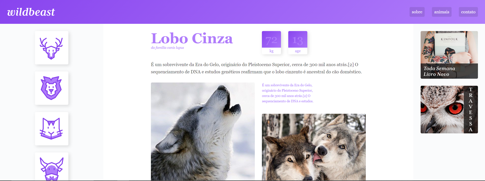

# WILDBEAST
> Projeto wildbeast criado no curso de CSS grid-layout da Origamid, com o foco de criar um site 100% responsivo.


## Link do curso

Origamid (<https://www.origamid.com/>)




## Como usar e ver o projeto

OS X & Linux:

```sh
Não é preciso instalar nada, apenas baixar o repositório e abrir o arquivo HTML em seu navegador.
```

Windows:

```sh
Não é preciso instalar nada, apenas baixar o repositório e abrir o arquivo HTML em seu navegador.
```

## Gostou ?

1. Conecte-se ao meu Linkdin (<https://www.linkedin.com/in/alex-teixeira-da-fonseca-5a99931a2/>)
2. Me seiga aqui no Git-hub 